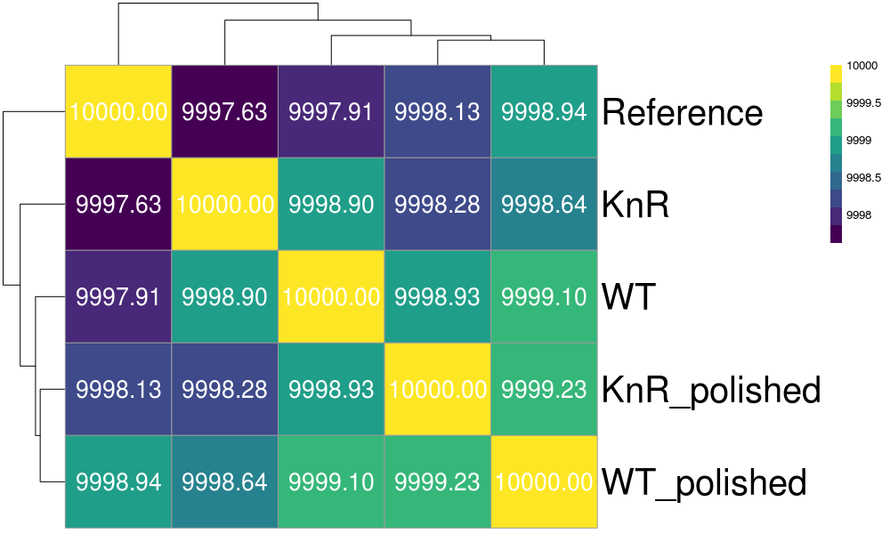
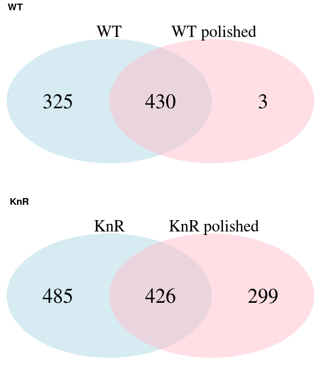

## Bdellovibrio Genome Polishing

### Description

* Target genome: *Bdellovibrio bacteriovorus* mother strain (109J WT:JWT), mutant strain(109J KNR)
* Sequencing method: Nanopore long read sequencing, polished with Illumina short reads
* Reference genome: *Bdellovibrio bacteriovorus* strain 109J (NCBI accession: NZ_CP007656)

### Genome Polishing

* Genome polishing
  * Genome assembly from previous long read sequencing result was polished with short reads
  * Genome polishing was done by *Pilon*
  * Genome completeness (BUSCO) of polished genomes increased comparable to reference genome

* Gene annotation
  * Gene annotation was done by *Prodigal*
  * Functional annotation were done by comparining genes to reference genome's annotation
  * *BLASTP* was performed between reference and WT/KnR proteins, WT/KnR proteins with over 99% percent identitiy to reference genes were annotated with reference gene's function

Feature | Reference | WT | **WT polished** | KnR | **KnR polished**
---- | ---- | ---- | ---- | ---- | ----
Total genome length (nt) | 3,830,427 | 3,836,685 | 3,837,019 | 3,836,591 | 3,836,926
Number of contigs | 1 | 1 | 1 | 1 | 1
Number of protein-coding genes | 3,606 | 3,727 | 3,632 | 3,766 | 3,636
Genome completeness (*BUSCO*) | 96.0% | 95.2% | **96.0%** | 92.7% | **96.0%**

* Similarity comparison between genomes
  * Average nucleotide identity (ANI) was calculated between genomes with *pyani*
  * Numbers inside the box is ANI * 10,000 (10,000 when 100% identical)

### Variant calling

* Variant calling
  * Variant calling was done by *MUMmer*
  * nucmer script was run between reference genome and WT/KnR and between WT and KnR strain
  * Variant information was reported from nucmer result by show-snps script
  * show-snps result was converted to vcf extension file
  * VCF file can be opened by *IGV* genome browser

* Variant comparison
  * Variant calling result before polishing were compared with result after polishing
  * Variants only found in unpolished genomes are likely to be sequencing errors corrected by short read polishing
  * From total of 755 variants between NCBI reference genome and unpolished WT strain genome, 430 variants were also found between reference genome and polished WT strain genome
  * 325 variants were only found in unpolished WT strain genome, and 3 variants were only found in polished WT strain genome
  * From total of 911 variants between NCBI reference genome and unpolished KnR strain genome, 426 variants were also found between reference genome and polished KnR strain genome
  * 485 variants were only found in unpolished KnR strain genome, and 299 variants were only found in polished KnR strain genome
