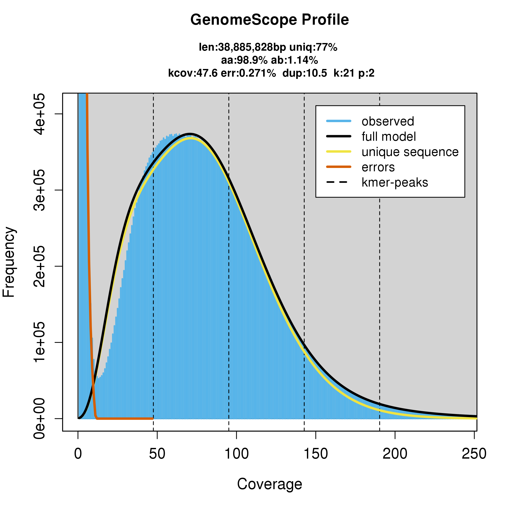

# 연구실 보유 상황버섯 균주의 ploidy 분석 결과

* 연구실에서 보유 중인 고려상황버섯(*Phellinus linteus*)과 장수상황버섯(*Phellinus baumii*) 균주의 ploidy 분석을 진행함.
* 두 균주의 현미경 상 균사 형태로는 고려상황버섯은 haploid, 장수상황버섯은 diploid로 추정됨.

## 고려상황버섯

* gDNA read sequence directory: /flareon/analysis2/Goryo_mushroom/reads_genome
* genome sequence directory: /flareon/analysis2/Goryo_mushroom/circos

* GenomeScope 분석 결과 확인되는 peak가 1개로 연구실에서 보유중인 고려상황버섯 균주는 haploid로 추정됨.
* BUSCO 분석 결과 contamination (duplication)은 1.1%로 확인됨.

## 장수상황버섯

* 장수상황버섯은 gDNA read data는 확인되지 않고 RNA-seq read data만 /flareon/analysis2/Goryo_mushroom/reads_Jangsu에 존재함.
* gDNA-seq data는 (구) mbn server HDD에 있을 것으로 추정됨.
* genome sequence directory: /flareon/analysis2/Goryo_mushroom/circos

* BUSCO 분석 결과 contamination (duplication)은 8.8%로 연구실에서 보유중인 장수상황버섯 균주는 diploid로 추정됨.
